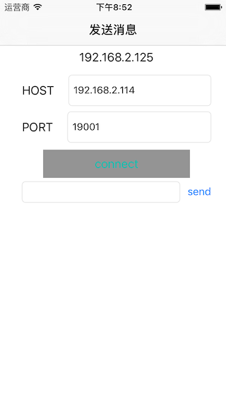
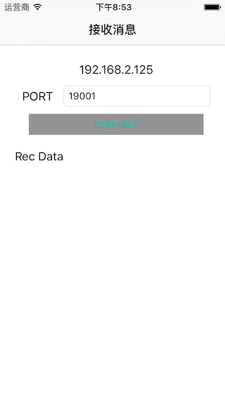

# TCP|UDP -- Socket
iOS 通过TCP|UDP来实现 两个设备近场通信.

## 两者主要分为 `发送端` 和 `接受端` 来展示.

### TCP ||  UDP
#### 发送端

#### 接受端

## Mac启动Server方式【可选】

### 终端cd 到TCP-UDP-Socket/Python 目录里面

python udp.py 启动UDP服务端

python tcp.py 启动TCP服务端
